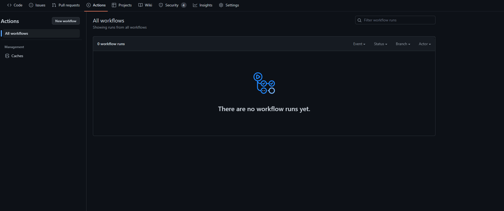
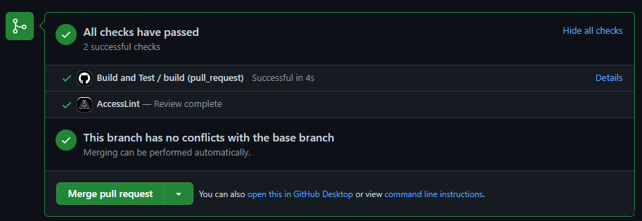
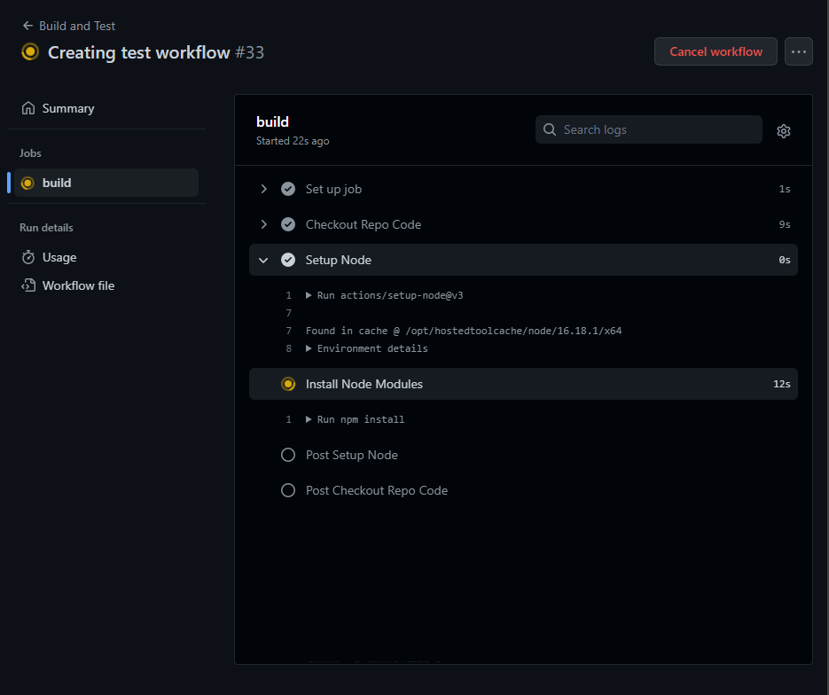

[GitHub Actions](https://docs.github.com/en/actions/learn-github-actions/understanding-github-actions) is a powerful CI/CD tool that allows us to setup workflows and automations that are triggered by events happening on your GitHub repo. In this case, we can use it to run tests each time new code is introduced to the production branch.

## 6.1 Creating a GitHub Action

To create a GitHub Action, first of we create a workflow file in `.github/workflows/` in the repo, and create a Yaml file for the workflow/action, eg. `.github/workflows/test.yml`. To start off we’ll create a workflow file that defines the workflow, sets the platform we’ll run it on and checks out the repository code to get started. 

```yaml
# Name of the Workflow
name: Build and Test

# How the workflow is triggered, in this case every time a pull request to the prod branch gets opened, reopened or the code in the PR gets updated
# https://docs.github.com/en/actions/using-workflows/events-that-trigger-workflows
on:
  pull_request:
    types: [opened, reopened, synchronize]
    branches: [prod]

# The jobs/tasks that the workflow completes, by default these will all run at the same time
# https://docs.github.com/en/actions/using-jobs/using-jobs-in-a-workflow
jobs:
  # Each job gets a different name, eg. `build`, but the name must be unique
  build:
    # Set the platform that the job will run on, you can choose a number of different options, but running on Linux is the cheapest option
    # https://docs.github.com/en/actions/using-jobs/choosing-the-runner-for-a-job
    runs-on: ubuntu-22.04
    # Each job has a number of steps to complete (these will complete one after another), most of the time your first step will be to checkout the repo code, otherwise you won't have anything to work with
    steps:
      - name: Checkout Repo Code
        uses: actions/checkout@v3
```

Once you have this workflow, commit and push the changes to GitHub, you can find any actions you have under the **Actions** tab in your repo, this is also where the logs will appear when the actions are triggered and run.



## 6.2 Triggering the Action

In the case of our workflow, it will only run when we create a pull request (PR) to the `prod` branch (if your main branch is named something else, make sure you change it to reflect your branch, eg. `main`). To test that it works, create a new branch, eg. `dev` and make a small change to the code, then [open a pull request](https://docs.github.com/en/pull-requests/collaborating-with-pull-requests/proposing-changes-to-your-work-with-pull-requests/creating-a-pull-request) into your main branch. Once the PR is opened, the action will automatically be triggered and will start running the job that we’ve defined, and show the status of it when it’s completed



So far all we’re doing now is checking out our code, so this should all pass. The good news is the action should also be triggered when the code in the PR updates, so we can continue to make changes to the workflow, push them to the same branch we’ve created (not the main branch), and it’ll run the newest changes to the workflow, without having to keep merging the changes in each time we make updates.


We can also view the actions being run under the **Actions** tab in the repo, here we can view the full history of all of our workflows (when we create more) and the status of the different workflow runs.

## 6.2 Action Steps

At the moment we’ve just checked the code in our repo out, next we need to go through and run the build and test steps. Each step has a number of different properties (we’ll get into more of them later), but for the most part they’ll have [a name](https://docs.github.com/en/actions/using-workflows/workflow-syntax-for-github-actions#jobsjob_idstepsname) so you can identify the step that’s running, and the [`uses` property](https://docs.github.com/en/actions/using-workflows/workflow-syntax-for-github-actions#jobsjob_idstepsuses) defines what actions package will be used to run the step. Depending on the package being used, we may also pass in some configuration under the [`with` property](https://docs.github.com/en/actions/using-workflows/workflow-syntax-for-github-actions#jobsjob_idstepswith), which allows defining values for the package to use.

```yaml
# Name of the action (this is for us to identify it when it runs)
- name: Setup Node
  # The GitHub Action package that we're using in this step, most of the time this is how we'll be defining what a step does
  uses: actions/setup-node@v3
  # Some actions will also require values/config to be passed in, so these are set under the `with` property
  with:
    # Eg. for the setup node package, it can take a value of which node version you want to use
    # https://github.com/actions/setup-node#supported-version-syntax
    node-version: 16
```

We’ve already checked out the repo code, so next we’ll add a step to setup node to use, and install the packages in the `package.json` file of my repo. As well as using packages with the `uses` property, we can also run commands on the action runner (similar to how we would in our terminal), so using the [`run` property](https://docs.github.com/en/actions/using-workflows/workflow-syntax-for-github-actions#jobsjob_idstepsrun), we can set it to run `npm install` and install all the node modules in the`package.json` file of our repo. 

```yaml
name: Build and Test

on:
  pull_request:
    types: [opened, reopened, synchronize]
    branches: [prod]

jobs:
  build:
    runs-on: ubuntu-22.04
    steps:
      - name: Checkout Repo Code
        uses: actions/checkout@v3

      - name: Setup Node
        uses: actions/setup-node@v3
        with:
          node-version: 16

      - name: Install Node Modules
        # We don't need a actions package to install node modules, instead we can run a command directly in the runner and install them the same way we would in our terminal
        run: npm install
```

If we access the workflow run via either the **Actions** tab, or by clicking the **Details** link for the test in the PR, we can view the steps being run, and the outputs to the console (if there are any). There are a couple of extra steps as well for GitHub to setup the environment, and clean up after everything is completed.

