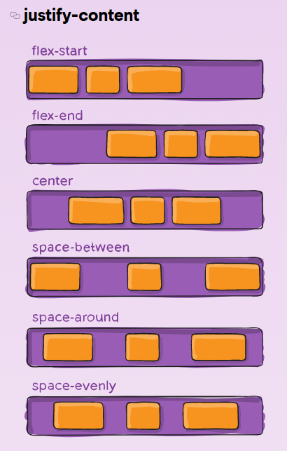
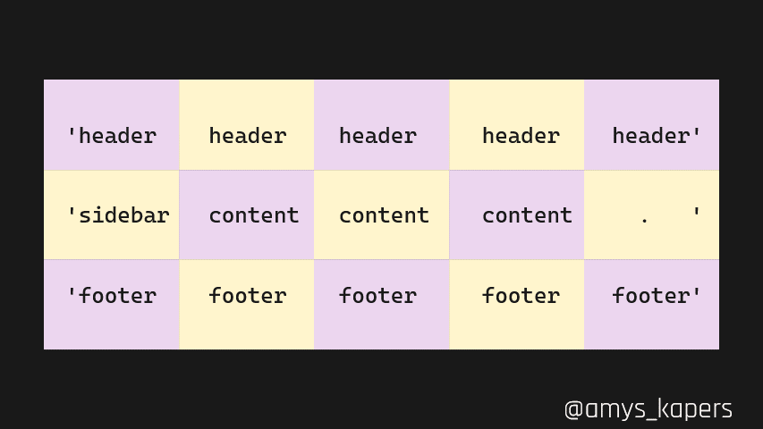

## 2.1 Flexbox

[Flexbox](https://developer.mozilla.org/en-US/docs/Web/CSS/CSS_Flexible_Box_Layout), using the `display: flex` property allows laying out and re-ordering it's children. This comes along with a bunch of [different properties](https://css-tricks.com/snippets/css/a-guide-to-flexbox/), and is really useful for laying items out in a flowing direction. 

```css
.container {
	display: flex;
}
```

### 2.1.1 Aligning & Justifying Flex Items

Once the container is using flexbox, the [`justify-content`](https://developer.mozilla.org/en-US/docs/Web/CSS/justify-content) property defines how the items lay out along the main axis (most of the time this is horizontally across the page) and how the space is allocated between them. In the cross axis (most of the time this is vertical), the [`align-items`](https://developer.mozilla.org/en-US/docs/Web/CSS/align-items) property will define how the flex children line up against one another.




```css
.container {
	display: flex;
	align-items: center;
	/* start end center stretch */
	justify-content: space-between;
	/* start end center stretch space-between space-around space-evenly */
}
```

### 2.1.2 Gaps

Using the `gap` property (or the `column-gap` and `row-gap` properties to define them separately), we can add spaces between each of the items.

```css
.container {
	/* column-gap: 10px;
	row-gap: 15px; */
	gap: 10px;
}
```

### 2.1.3 Wrapping Items

When there are more items than fit in one row, they will overflow by default. You can use the [`flex-wrap`](https://developer.mozilla.org/en-US/docs/Web/CSS/flex-wrap) property to allow wrapping onto one line.

```css
.container {
	flex-wrap: wrap;
	/* wrap nowrap wrap-reverse */
}
```

### 2.1.4 Growing and Shrinking Items

By default flex items will adjust size where necessary, growing and shrinking as defined. The [`flex-grow`](https://developer.mozilla.org/en-US/docs/Web/CSS/flex-grow) and [`flex-shrink`](https://developer.mozilla.org/en-US/docs/Web/CSS/flex-shrink) property defines if an item will grow or shrink by giving it a positive number, any additional space is then allocated/removed depending on the value (eg. an item with a `flex-grow` value of `4` will get four times as much space as one with a value of `1`). The [`flex-basis`](https://developer.mozilla.org/en-US/docs/Web/CSS/flex-basis) property defines the initial size of an item (by default it'll inherit the item width, or you can give it a pixel value).


```css
.item {
	flex-grow: 4;
	flex-shrink: 1;
	flex-basis: 300px;
}
```

### 2.1.5 Vertical Centring

Flexbox is useful for vertically centring content, like aligning labels next to checkboxes.

### 2.1.6 Ordering Items

We can change the order the flex children appear on the page without changing their source order using the [`order`](https://developer.mozilla.org/en-US/docs/Web/CSS/order) property. By default each item has an implicit value of `0`, a negative number will bring it to the start and a positive number will put it at the end. Based on these numbers they'll then be sorted.


```css
.container {
	display: flex;
	flex-direction: column;
}

.item {
	order: -1;
}
```

## 2.2 CSS Grid

[CSS Grid](https://css-tricks.com/snippets/css/complete-guide-grid/) (`display: grid`) is more powerful than Flexbox and has greater control over items in both vertical and horizontal directions. 

```css
.container {
	display: grid;
}
```

### 2.2.1 Grid Columns and Rows

Using the `grid-template-columns` and `grid-template-rows` properties we can define the columns the grid layout uses, with spaces between each defined size (any CSS unit is valid).

```css
.container {
	grid-template-columns: 200px 20% 10vw;
}
```

#### 2.2.1.1 Repeat Function

To reduce code, we can use the [`repeat()`](https://developer.mozilla.org/en-US/docs/Web/CSS/repeat) function to repeat columns a certain number of times.

```css
.container {
	/* 200px 200px 200px */
	grid-template-columns: repeat(3, 200px);
	/* 100px auto 100px auto */
	grid-template-rows: repeat(2, 100px auto);
}
```

#### 2.2.1.2 Fractional Units

There is a new responsive unit as part of CSS Grid as well, the [`fr`](https://developer.mozilla.org/en-US/docs/Web/CSS/CSS_Grid_Layout/Basic_Concepts_of_Grid_Layout#the_fr_unit) unit. This unit allocates empty space between elements (similar to `flex-grow`), eg. twice as much space will be allocated to the `2fr` column than to the `1fr` column.

```css
.container {
	grid-template-columns: 100px 1fr 50px 2fr;
}
```

#### 2.2.1.3 Automatic Columns and Rows

To automate the layout further, we can use the [`auto-fit` and `auto-fill` properties](https://css-tricks.com/snippets/css/complete-guide-grid/#aa-the-repeat-function-and-keywords) to [create columns depending](https://codepen.io/SaraSoueidan/pen/JrLdBQ) on the screen size:

- [`auto-fill`](https://developer.mozilla.org/en-US/docs/Web/CSS/repeat#auto-fill): Create as many columns as it can fit, even if there's not enough grid-items
- [`auto-fit`](https://developer.mozilla.org/en-US/docs/Web/CSS/repeat#auto-fit): Create as many columns as it can fit, but no more than the number of grid items


We can also use the [`minmax()`](https://css-tricks.com/snippets/css/complete-guide-grid/#aa-sizing-functions) function to create a flexible column that resizes as needed.

```css
.container {
	grid-template-columns: 
		repeat(
			auto-fill, 
			minmax(200px, 1fr)
		);
}
```

### 2.2.2 Gaps

Similar to flexbox, to add a gap between the items, the [`column-gap` and `row-gap`](https://css-tricks.com/snippets/css/complete-guide-grid/#aa-gapgrid-gap) properties (and `gap` as the shorthand).

```css
.container {
	column-gap: 20px;
	row-gap: 10px;
	/* gap: 20px 10px; */
}
```

### 2.2.3 Grid Areas

As well as auto-allocating items to spots on the grid, we can define areas and assign elements manually for greater control. Using the [`grid-template-areas`](https://css-tricks.com/snippets/css/complete-guide-grid/#aa-grid-template-areas) property we can add name labels to the different areas of the grid, these can spread across different sections to form a larger area. The definition of these areas is fairly forgiving on white space, so it's good practice to line these up to easier visualise the grid layout. Each row is a separate string inside quotes and each column is separated by at least one space, with any string value being a valid area name (even emojis).

```css
.container {
	display: grid;
	grid-template-columns: repeat(5, 1fr);
	grid-template-rows: 100px 1fr 50px;
	grid-template-areas:
		'header   header   header   header   header'
		'sidebar  content  content  content   .    '
		'footer   footer   footer   footer   footer';
}
```



Once the areas are named, you can assign items to the areas using the [`grid-area`](https://css-tricks.com/snippets/css/complete-guide-grid/#prop-grid-area) property.

```css
.header_item {
	grid-area: header;
}
```

### 2.2.4 Styling Fallbacks

If you're having to support [older browsers that don't support](https://caniuse.com/css-grid) CSS Grid, you can use the [`@supports` query](https://developer.mozilla.org/en-US/docs/Web/CSS/@supports) to check for browser support first, and use flexbox or another layout method.

```css
@supports(grid-template-columns: 20px) {
	/* CSS Grid code goes here */
} 
```