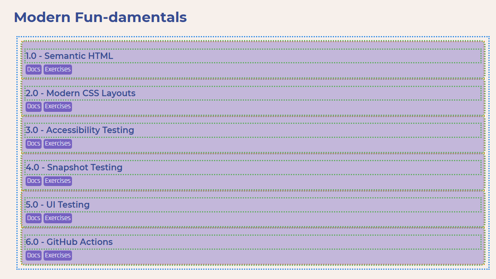
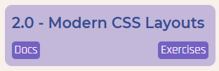

## 2.1 Flexbox

Use flexbox to align the menu items in the header next to one another

### 2.1.2 Gaps

Add space between each of the menu items.

### 2.1.3 Wrapping Items

On the [homepage](/), use flexbox to align the section cards next to one another with a gap between them and wrap onto multiple lines if they don't all fit on one row.

### 2.1.4 Growing and Shrinking Items

Align the cards and make sure they're at least 200px wide but will stretch/shrink as required.

### 2.1.5 Vertical Centring

Use the align-items, align-content and justify-content properties to vertically centre the items in the header and put horizontal spacing between them.

### 2.1.6 Ordering Items

Use the order property to change the order of the sections so that the current section is first, the completed sections are last and the rest are in the middle.

*Hint*: there's a data attribute on each section with the section numbering, eg. `.item[data-section="2.0"]` would select the current section (2.0 Modern CSS).

## 2.2 CSS Grid

### 2.2.1 Grid Columns and Rows

Define a CSS Grid layout for the homepage, there should be equal width columns.

*Hint*: Keep the flexbox code there, we'll use it later, but comment it out for now

#### 2.2.1.3 Automatic Columns and Rows

Update the feed to have more responsive columns that are at least 250px wide

### 2.2.2 Gaps

Replace the existing `gap` with a different gap between columns and rows.

### 2.2.3 Grid Areas

Use grid areas to lay out the cards so they match the design.

*Hint*: The links should always be fixed to the bottom of the card, even if the card is bigger because of other titles wrapping.

### 2.2.4 Styling Fallbacks

Wrap all the grid code in a `@supports` query, keeping the original flexbox code as a fallback